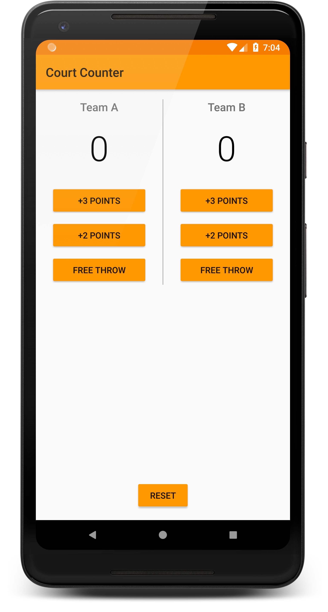

# Court Counter

**Platform: Android (Min SDK: 19, Target SDK: 27)**

**Author: [Timotius Oktorio](https://ca.linkedin.com/in/timotiusoktorio "LinkedIn Profile") (toktorio@gmail.com)**

Simple score keeper app which can be used to keep track of the score of two different teams playing basketball.

*This app is created as the second project of [Android Basics Nanodegree](https://www.udacity.com/course/android-basics-nanodegree-by-google--nd803) program at Udacity.*

### Features
- Keep track of the score of two different teams who are playing in a basketball match.
- Simple and straightforward design to make it easy for any user to use the app.
- Design support for both portrait and landscape orientation.

### What I have learned from this project
- Adding multiple buttons into the app.
- Updating views with new data on every button clicks.
- Properly scoping variables (local or global).
- Finding views by their ID using Java code.

 

Get the apk file [here](https://github.com/toktorio/Court-Counter/blob/master/app/release/court-counter.apk?raw=true) to install the app on your device. Note that depending on your device settings, you might need to allow installation from unknown sources in order to install this app. Visit this [link](https://www.androidcentral.com/unknown-sources) for the detailed instructions.